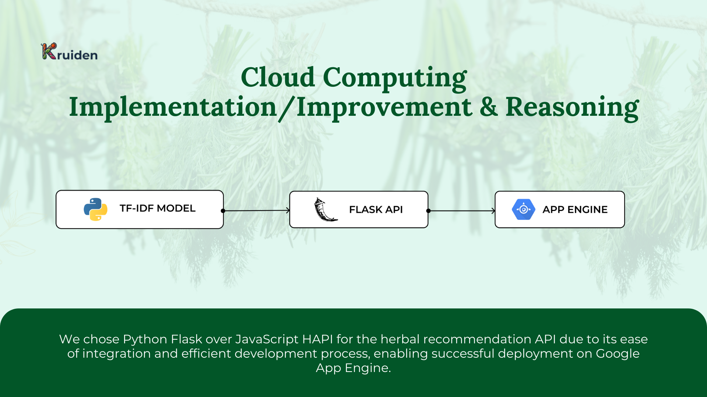
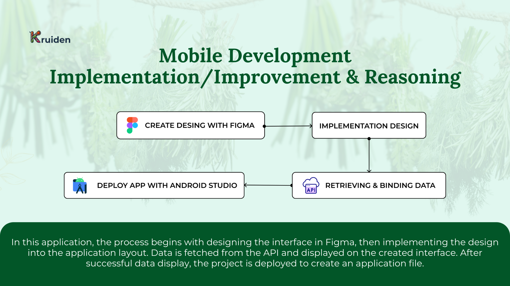
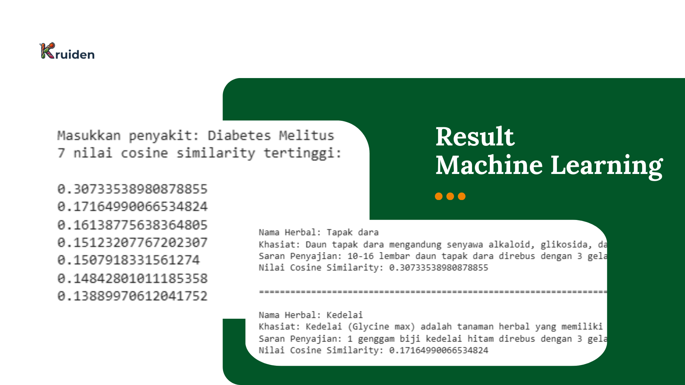
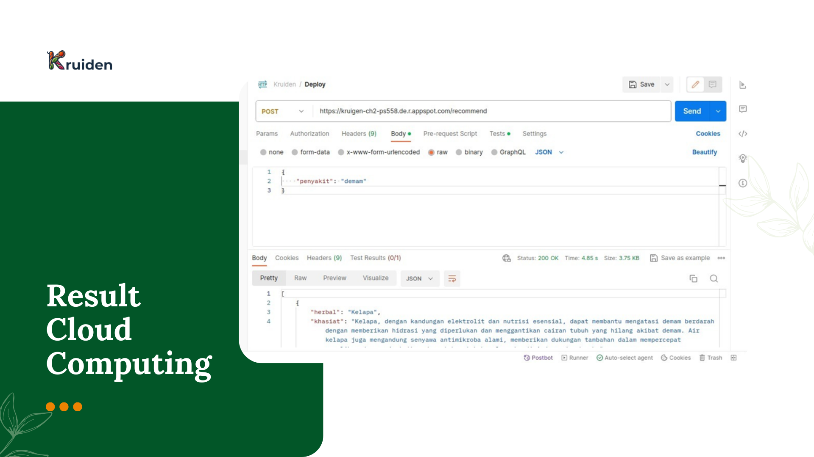
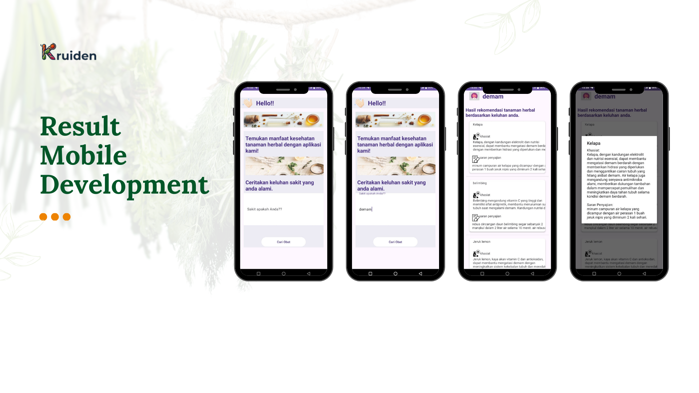

  

<h2 align="center">Product-based Capstone Project Bangkit 2023</h2>

## Task List
- Machine Learning
  - [x] Datasets: [DatasetHerbat.csv](CC/DatasetHerbal.csv)
  - [X] Pre-processing: [Kruiden.ipynb](ML/Kruiden.ipynb)
  - [X] Training and validation
  - [X] Testing

- Cloud Computing
  - [x] Build a cloud storage
  - [X] Build an backend API: [main.py](CC/main.py)
  - [X] Deploy App Engine: [API Recommend](https://kruigen-ch2-ps558.de.r.appspot.com/recommend)

- Mobile Development
  - [x] Layout
  - [x] Kruiden Apps: [Kruiden.apk](MD/kruiden.apk)

## Implementation/Improvement & Reasoning
- 
- 
- 

## Result
- 
- 
- 